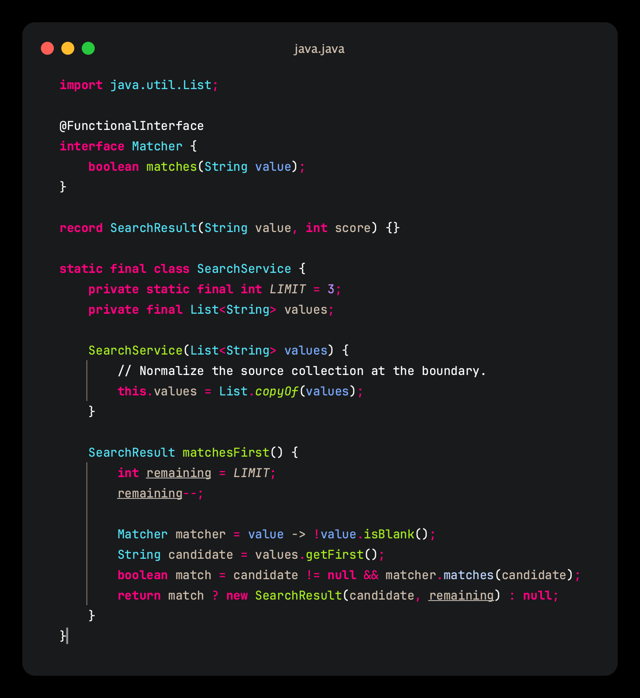
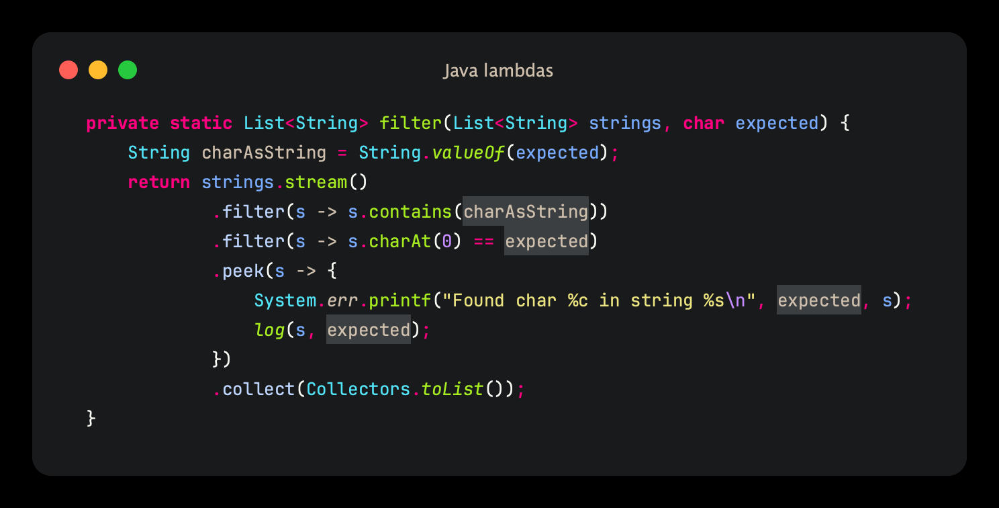
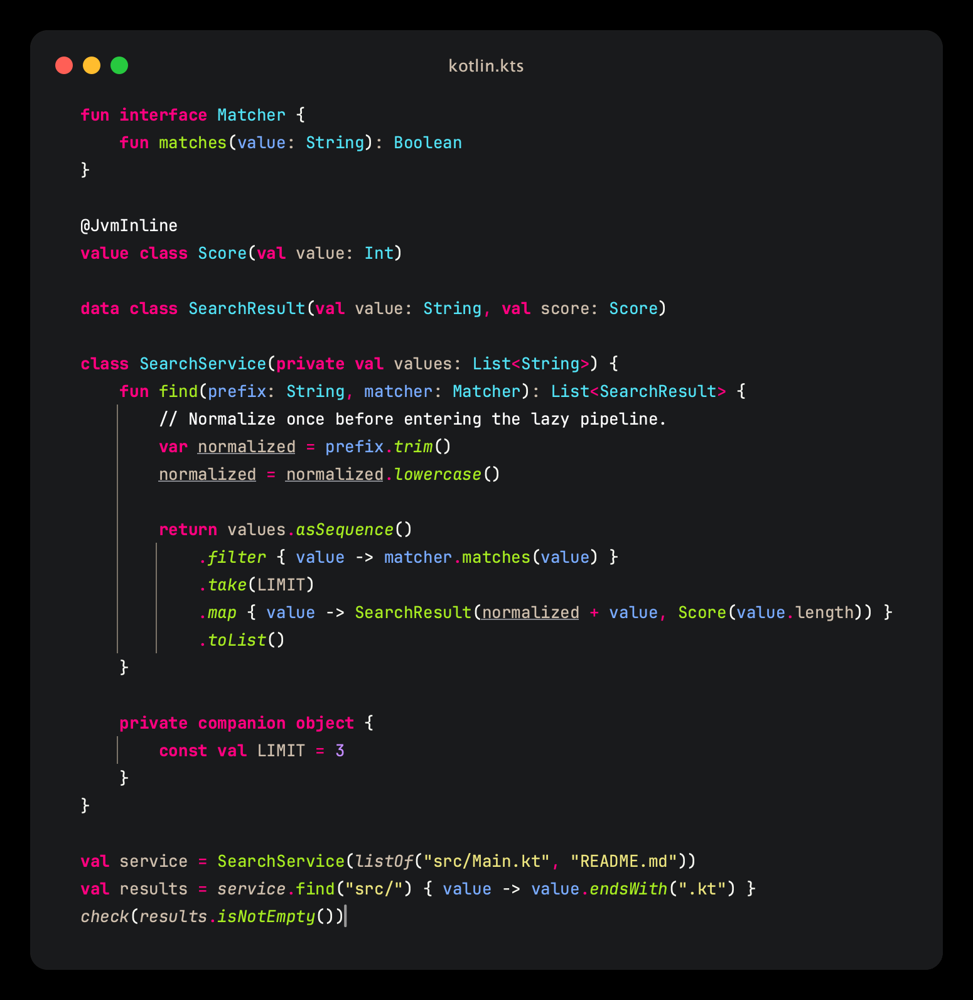
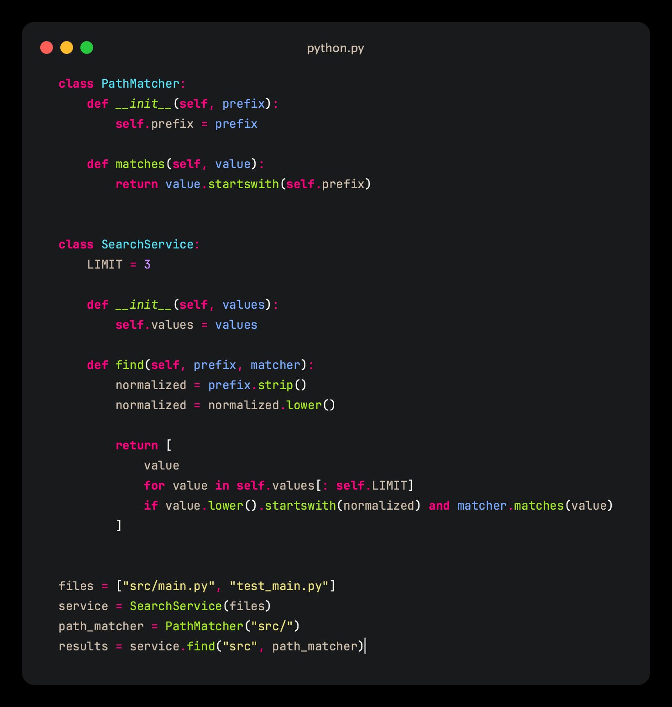

# Invariant

Invariant is a semantic dark editor color scheme based on Monokai. It grew from an Eclipse theme I started using in 2014 and is primarily maintained for IntelliJ IDEA, with ports for Visual Studio Code and Vim/Neovim.

The scheme uses color to identify what a symbol is and formatting to show how it is being used. Common code stays relatively quiet, while types, parameters, methods, and reserved words remain easy to find.



## Semantic colors

The same kind of symbol should keep the same foreground wherever it appears. A class does not change color when used as a constructor or a static qualifier, and a field does not become a different color merely because it is read from another expression.

| Meaning | Style | Examples |
| --- | --- | --- |
| Variables and fields |  Warm neutral `#cfbfad` | Locals, instance fields, global variables |
| Parameters |  Blue `#79abff` | Function, method, and lambda parameters |
| Types |  Cyan `#52e3f6` | Classes, interfaces, records |
| Type parameters |  Muted rose `#bfa4a4` | Generic type declarations and references |
| Implemented methods |  Green `#a7ec21` | Concrete declarations and calls |
| Signature-only methods |  Pale blue `#bed6ff` | Abstract and interface methods |
| Keywords and reserved names |  Bold pink `#ff007f` | `class`, `return`, `this`, `self`, `null` |
| Strings |  Pale yellow `#ece47e` | String and character literals |
| Numbers |  Purple `#c48cff` | Numeric literals |
| Annotations and metadata |  White `#ffffff` | Annotations and attribute names |
| Comments |  White `#ffffff` | Line, block, and documentation comments |

Comments are intentionally prominent. A comment should be noticed, and a file with too many comments should look like it has too many comments.

### Color says what; formatting says how

Context normally adds formatting without replacing a symbol's identity color:

- A reassigned variable or parameter gains an underline but keeps its foreground.
- Static members are italic; instance members are not.
- Inspection results add their underline, wave, border, or background over the existing syntax colors.
- Read-only and other contextual distinctions may use bold or italic where the editor exposes them reliably.

A captured Java variable is a useful boundary case. A method parameter is blue in the enclosing method, but IntelliJ presents its use inside a lambda as a neutral field-like capture. Its semantic role has changed: the generated lambda object effectively carries that value as state.

Method implementation is the deliberate foreground exception. Concrete methods are green, while methods that only provide a signature are pale blue. This makes calls through an interface or abstract type distinguishable without navigating to the declaration first.

## Examples

### Java

The Java example includes a record, fields, parameters, a reassigned local, static members, an interface method, and captured values inside lambdas. The parameter declarations are blue; their captured uses inside the lambda are neutral. Concrete calls are green, while the interface call uses the signature-only method color.



The lambda parameter remains blue, while values captured from the enclosing method gain a neutral highlight without changing their underlying semantic color. The [same capture with IntelliJ inlay hints enabled](docs/images/intellij-java-lambdas-hints.png) is also kept for comparison.

### Kotlin



Kotlin follows the same language-default meanings for types, parameters, variables, and functions. Kotlin-specific entries are kept only where the plugin exposes a distinct concept, such as named arguments, smart casts, or function-literal punctuation. Lambda arrows remain neutral, matching Java.

### Python



Python keeps parameters blue, fields neutral, calls green, and reserved names such as `self` and `cls` pink. Built-in names remain pale blue. Special method calls are green and italic; predefined fields remain neutral and italic.

## Language support

IntelliJ's Language Defaults provide the base mapping for every language that uses them. The following languages also have explicit entries in the scheme:

| Language | Explicit coverage |
| --- | --- |
| Java | Primary target; declarations, calls, fields, captures, records, annotations, and implementation distinctions |
| Kotlin | Kotlin-specific operators, arrows, dynamic calls, named arguments, and smart-cast contexts |
| Python | Built-ins, `self`, predefined names, annotations, and type parameters |
| CSS | Classes, functions, hashes, identifiers, and property names |
| Shell Script | External commands and subshell commands |

Other IntelliJ languages receive the semantic Language Defaults automatically. Their plugins may add concepts that have not yet been tuned here.

## Installation

### JetBrains IDEs

Install **Invariant** from the Plugins Marketplace, or import [`jetbrains/invariant.icls`](jetbrains/invariant.icls) manually from **Settings → Editor → Color Scheme → Import Scheme**.

### Visual Studio Code

Install **Invariant** from the Extensions Marketplace and select it from **Preferences: Color Theme**. To test the source locally, open the [`vscode`](vscode) directory in Visual Studio Code and press `F5`.

### Vim or Neovim

With [lazy.nvim](https://github.com/folke/lazy.nvim), add:

```lua
{
  "andrebrait/invariant-colors",
  lazy = false,
  priority = 1000,
  config = function()
    vim.cmd.colorscheme("invariant")
  end,
}
```

For vim-plug, use `Plug 'andrebrait/invariant-colors'`. You can also copy [`colors/invariant.vim`](colors/invariant.vim) into `~/.vim/colors/` or `~/.config/nvim/colors/`. Then configure:

```vim
colorscheme invariant
```

True-color terminals give the intended palette; a 256-color fallback is included.

## Editor differences

JetBrains IDEs can distinguish captures and whether a Java method has an implementation. Visual Studio Code and Neovim preserve the distinctions emitted by their language services, but a color theme cannot infer semantic information that the service does not provide. Plain Vim syntax highlighting cannot determine captures or abstract versus concrete methods.

### Platform backgrounds

The IntelliJ scheme inherits from Islands Dark. IntelliJ inherits a text-attribute entry as a whole, so the scheme cannot keep its warm-neutral default foreground while inheriting only the editor background. The `TEXT` background therefore copies Islands Dark 2026.2's `#191a1c` value.

The console, documentation popup, completion popup, and gutter backgrounds remain inherited. Their current Islands Dark values are recorded in comments in the `.icls` file. The Vim port uses those same fixed surfaces.

The Visual Studio Code port instead uses the current VS Code Dark surfaces: `#121314` for the editor and gutter, `#191a1b` for the terminal and peek views, and `#202122` for documentation and completion widgets.

## Verification

```sh
npm test --prefix vscode
npm run package --prefix vscode
gradle -p jetbrains buildPlugin verifyPlugin
```

## Releasing

Publishing a GitHub Release runs [the release workflow](.github/workflows/release.yml). The tag must match the version in [`vscode/package.json`](vscode/package.json), using `1.0.0` rather than `v1.0.0`. The workflow attaches both installable archives to the GitHub Release, publishes the VS Code extension through trusted publishing, and publishes the signed JetBrains plugin. Vim and Neovim package managers use the same Git tag directly.

Before the first release, the JetBrains Marketplace plugin must be created manually and the repository must have `PUBLISH_TOKEN`, `PRIVATE_KEY`, `PRIVATE_KEY_PASSWORD`, and `CERTIFICATE_CHAIN` Actions secrets. The Visual Studio Marketplace publisher must trust this repository and `.github/workflows/release.yml` through its GitHub Actions publishing policy.

## Provenance

Invariant descends from the [Sublime Text 2](https://github.com/eclipse-color-theme/eclipse-color-theme/blob/19b3d30e7d20f358c1a6638829ddddbe1e98cd84/com.github.eclipsecolortheme/src/com/github/eclipsecolortheme/themes/sublime-text-2.xml) Eclipse color theme by Filip Minev, distributed with Eclipse Color Theme under EPL-1.0. That scheme is based on [Monokai](https://monokai.pro/history), created by Wimer Hazenberg. Invariant preserves its distinctive semantic palette while incorporating years of changes and ports to current editors.

## License

Invariant is licensed under the [Eclipse Public License 2.0](LICENSE). Its source is available in this repository under the same license.
